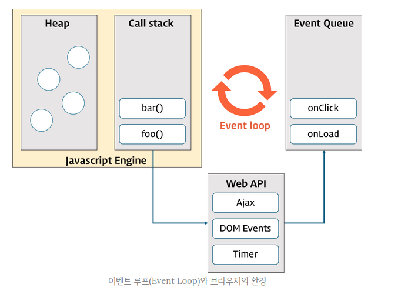

# 자바스크립트 이벤트 루프

**KEY WORD**
> call stack
web API
event queue
event loop
async function
callback function

`one thread == one call stack == one thing at a time`ue
`stack 후입선출`
`queue 선입선출`

### 이벤트 (event)

- 브라우저에서 사용자가 버튼을 클릭하거나 웹페이지가 로드될 때와 같은 것 (DOM 요소와 관련됨)
- 이벤트 발생 시점이나 순서는 예측 불가

    → **일반적인 제어흐름**과 다른 접근방식 필요   

    → 누군가 이벤트를 감지하고 그에 대응하는 처리를 호출해 주어야 함

- 브라우저는 이벤트를 감지하고 통지해주는데 이를 통해 사용자와 웹페이지의 상호작용이 가능

    → 이벤트가 발생하면 실행되는 함수 (**이벤트 핸들러**)가 반응

### 이벤트 루프 (Event Loop)와 동시성(Concurrency)

브라우저는 단일 쓰레드(single-thread)에서 이벤트 드리븐(event-driven) 방식으로 동작

- **단일 쓰레드** : thread가 1개, 1개의 작업만 처리 가능
- **이벤트 루프** :  자바스크립트의 동시성(Concurrency)을 지원하여 웹 앱이 많은 작업을 동시에 처리 하는 것처럼 느껴지게 함



> call stack

작업이 요청되면 (함수가 호출되면) 작업은 순차적으로 콜스택에 쌓임
자바스크립트는 단 하나의 콜스택을 사용하므로 해당 작업이 종료되기 전까지 다른 작업 수행불가

> heap

동적으로 생성된 객체 인스턴스가 할당되는 영역
(ex. 우리가 프로그램에 선언한 변수, 함수 등이 담겨있음)

동시성을 지원하기 위해 필요한 비동기 요청(이벤트를 포함) 처리는 자바스크립트 엔진을 구동하는 환경 즉 브라우저 또는 Node.js가 담당한다.

> event queue (callback queue, task queue)

비동기 처리 함수의 콜백 함수, 비동기식 이벤트 핸들러, Timer함수의 콜백 함수가 보관되는 영역

**(한마디로 비동기적으로 실행된 콜백함수들 보관 영역)**

call stack이 비어졌을 때 순차적으로 call stack으로 이동되어 실행됨

> event loop

콜스택 내 현재 실행중인 task가 있는지, 이벤트 큐에 task가 있는지 반복 확인
콜스택이 비었다면 이벤트 큐 내의 task가 콜스택으로 이동하고 실행됨

<br>
Q. func1 호출 시 콘솔에 순차적으로 어떤 값들이 찍힐 것인가?

```js
function func1() {
  console.log('func1');
  func2();
}

function func2() {
  setTimeout(function () {
    console.log('func2');
  }, 0);

  func3();
}

function func3() {
  console.log('func3');
}

> 'func1' 
> 'func3'
> 'func2'
```

1. 콜스택에  func1 →  func2 → setTimeout(callback) → func3 순서로 쌓임
2. setTimeout의 콜백은 즉시 실행되지 않고 web API로 이동
3. timer 작동(0초) 후 callback이 이벤트 큐로 이동
4. 콜스택이 비워지는지 이벤트 루프가 계속 확인 
(스택은 후입선출이므로 func3 - func2 - func1 순서로 비워짐)
5. 콜스택이 비워지면 이벤트 큐에 있던 callback이 콜스택으로 이동 
(큐는 선입선출이므로 먼저 들어온 콜백이 콜스택으로 이동, 
이 예제에서는 이벤트 큐에 자리잡은 콜백함수는 1개)
6. 콜백함수 실행


헷갈린다면 이 예제로!

```js
function func1() {
  console.log('func1 start');
  func2();                   
  console.log('func1 end');
}

function func2() {
  console.log('func2 start');   
  setTimeout(function () {      
    console.log('func2 callback');
  }, 0); 

  func3();                      
  console.log('func2 end'); 
}

function func3() {
  console.log('func3 start'); 
  console.log('func3 end')
}

func1()
> undefined
// func1 start
// func2 start
// func3 start
// func3 end
// func2 end
// func1 end
// func2 callback
```


***
[Poiemaweb 5.32 Event](https://poiemaweb.com/js-event) 공부
***