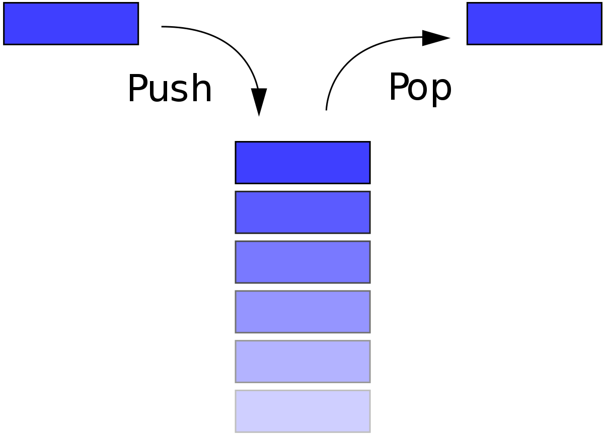

# Stack vs Queue
공통점
- 데이터를 집어넣을 수 있는 선형(linear) 자료형
- 한 번에 하나의 데이터만 처리 가능

차이점 
- 데이터의 추가 삭제가 같은 쪽에서 일어나는가
- 어떤 데이터가 먼저 나가는가 

> Stack

- 특징 
데이터의 추가 및 삭제가 한 쪽(같은쪽)에서 실행된다.
마지막에 들어온 데이터가 먼저 나간다. (후입선출, LIFO)
서로 관계가 있는 여러 작업을 연달아 수행하면서 이전의 작업 내용을 저장해 둘 필요가 있을 때 널리 사용

- method
push: 스택에 데이터를 삽입한다.
pop: 스택에서 데이터를 제거한다.

- 예시
자바스크립트의 콜스택

> Queue

- 특징
데이터의 추가가 한 쪽에서 실행되고 제거는 반대쪽에서 실행된다.
처음 들어온 데이터가 먼저 나간다. (선입선출, FIFO)
순서대로 처리해야 하는 작업을 임시로 저장해두는 버퍼(buffer)로써 많이 사용

- method
enqueue: 큐에 데이터를 삽입한다.
dequeue: 큐에서 데이터를 제거한다.

- 예시
자바스크립트의 이벤트 큐

 
 

참고자료
* * *
https://ko.wikipedia.org
https://helloworldjavascript.net/pages/282-data-structures.html
* * *