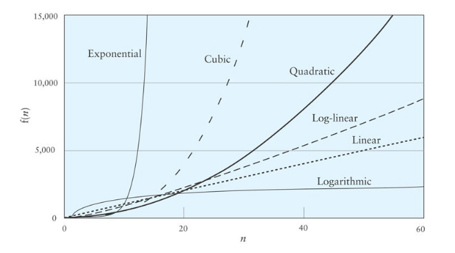

# 알고리즘과 복잡도

## 알고리즘의 분석

알고리즘의 자원 사용량(비용)을 분석
자원(비용 단위): **실행 시간**, 메모리, 저장장치, 통신 

## 알고리즘 예

- 책읽기

    첫 쪽부터 끝까지 차례로 읽는다. 총 n쪽의 책이라면 n번 쪽수를 념겨야 다 읽는다.

- 자연수(n≥2)이 주어졌을 때 1x2...xn을 계산하기

    2부터 n까지 n-2번 곱하면 계산이 된다.

- 주머니의 숫자 중에서 제일 큰 숫자 찾기

    주머니에서 숫자를 꺼내면서 현재까지 가장 큰 것을 기억한다. 주머니가 빌 때까지 찾아낸 가장 큰 것이 제일 큰 숫자다. n개의 숫자가 있었으면 n번 주머니에서 꺼내게 된다.

- 패스워드 해킹하기

    초보 해커들이 패스워드를 맞추는 방법은 모조리 훑기다. 10진수 4자리 수가 패스워드라고 하자. 해커는 0000부터 9999까지 넣어본다. 이 방법은 패스워드 자릿수가 n개라면 최대 10의 n승 번 시도해야 맞출 수 있다.

## 비용

알고리즘의 실행 비용(복잡도complexity)에서 우리의 관심은 입력의 크기에 따라 비용이 어떻게 증가하는지다. 입력의 크기란 앞서 본 알고리즘 예에서처럼 책의 두께, 자연수의 크기, 주머니에 있는 숫자의 개수 등을 말한다. **비용의 단위는 시간이나 메모리다.**

알고리즘 실행 비용은 입력 크기의 함수로 나타나는데, 입력이 커지면서 결국 어떻게 될지에 관심이 있다.

예를 들어 2의 n승은 n의 10승 보다 결국에는 훨씬 커진다. 초반엔 n의 10승이 크지만 59부터 역전되면서 2의 n승이 가속도를 내며 차이를 벌린다.

## 'big-O'표기법

알고리즘 복잡도의 종류를 구분하는 표기법인데, 입력의 크기를 n이라 하고, 계산 비용이 입력이 커지면서 결국 어떤 함수 f(n)의 상수곱을 넘지 않으면 O(f(n)이라고 쓴다.

예를 들어 어떤 알고리즘 비용이 5n+3이면 O(n)이다. 
2n^3(세제곱) + n^2(제곱) 이었으면 O(n3)이다.
즉 제일 차수가 높은 항만 남기고 계수는 무시하면 된다.

## 이진탐색

한 번 비교할 때마다 남아있는 데이터가 절반으로 줄어든다. 따라서 시간 복잡도는 O(logn)이다.

예시 : 1~100 까지 숫자중 특정 숫자를 맞추는 업다운(UpDown) 게임

→ 50보다 크냐 (절반 줄어듬)

→ 25보다 크냐 (절반 줄어듬)

→ 12.5보다 크냐 (절반 줄어듬)

...

2의 몇(k)승이 100(n)인가
탐색을 몇 번해야 되는가 ? logn번

## 현실적

쓸만한 알고리즘. 그 비용이 결딘 만하면 현실적인 알고리즘이다.

알고리즘의 실행비용(복잡도)이 입력 크기(n)에 대해 상수승을 가지면

n^k (상수k)

'현실적'이라고 본다. 예를 들어 O(n^2) 혹은 O(n^3.t)나 O(n^100) 등이다. 입력 크기가 커지면 다항으로 증가하는 비용이다.

왜 다항이 '현실적인' 비용인가? 그런 알고리즘은 컴퓨터 성능이 곱하기로 빨라지면 (px*) 곱하기로 이득을 본다. (p'x*). 알고리즘 비용이 n^k라고 하자. 컴퓨터 성능이 p배 빨라지면 같은 입력에 대해서 내용이 n^k / p로 준다. 따라서 예전과 같은 시간에 처리할 수 있는 입력의 크기는 p^1/k x n로 늘릴 수 있다. p^1/k배 커진 입력을 같은 시간에 처리할 수 있게 되는 셈이다. 디지털 컴퓨터 성능은 약 2년마다 2배씩 성능이 좋아졌다. 알고리즘 비용이 O(n)이라 하자. 그러면 2년 후 2배 빨라진 컴퓨터로는 2배 큰 입력을 같은 시간에 처리할 수 있게 된다. 비용이 O(n^2)이라면?

루트2배 큰(약 40% 큰) 입력을 같은 시간에 처리할 수 있다.

실제 현실적인 비용은 다항 중에서도 O(n), O(n^2), O(n^3)까지 정도이다. 그 이상의 차수는 아무리 다항이라도 실제 쓰기에는 너무 비싸다.