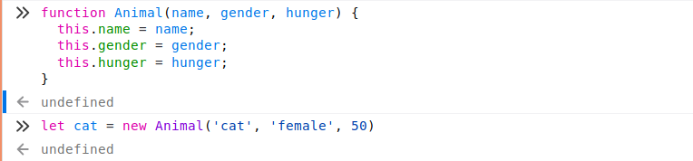
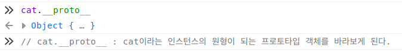
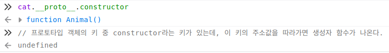
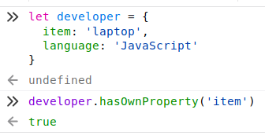

# Inheritance

- **constructor**

    원형객체의 속성과 메소드를 가지는 객체를 찍어내기 위한 공장 역할을 하는 함수

- **Prototype Object**

    생성자 함수를 통해 찍어내게 될 객체의 틀이 되는 원형객체 

    생성자 함수를 통해 찍어내게 될 객체의 부모역할을 하는 객체

- **instance**

    생성자 함수를 통해 생산된 원형객체와 닮은(원형객체의 속성과 메소드를 가지는) 객체

- **__proto__**

    인스터스의 프로토타입(원형)을 가리키는 내부 슬롯  = **[ [Prototype] ]**

- **Prototype chain**

    어떤 객체의 속성이나 메소드에 접근하려고 할 때, 그 객체 자신에게 속성이나 메소드가 없다면 __proto__  가 가리키는 프로토타입 객체의 속성값이나 메소드를 검색하는데, 이렇게 연결되어 있는 관계

- **inheritance**

    prototype chain으로 프로토타입 객체의 속성이나 메소드를 인스턴스가 공유하는 것

    부모객체의 속성이나 메소드를 자식객체가 접근할 수 있는 것, 가지고 있는 것처럼 사용할 수 있는 것

## constructor

원형객체를 본 뜬 객체를 찍어내는 객체공장. 생성자 함수.

생성자 함수가 프로토타입 객체를 원형으로 하는 인스턴스를 찍어내는데, 이 때 프로토타입 객체의 property중 constructor라는 프로퍼티가 있다. 이 constructor 프로퍼티는 생성자 함수를 가리키는 주소값을 갖고 있다. 

## Prototype Object

자바스크립트의 모든 객체는 자신의 부모 역할을 담당하는 객체와 연결되어 있다. 부모 객체의 속성이나 메소드를 상속받아 사용할 수 있게 한다. 이러한 **부모 객체**를 **Prototype(프로토타입)객체** 줄여서 **Prototype(프로토타입)** 이라 한다.

*프로토타입 객체는 생성자 함수에 의해 생성된 각각의 객체에 **공유 프로퍼티**를 제공하기 위해 사용한다.*

    let obj1 = {
      name: 'sally';
      age: 29;
      sum: function() {
        return `hello ${this.name}`;
      }
    }
    
    let obj2 = {
      name: 'sun';
      age: 29;
      sum: function() {
        return `hello, ${this.name}`;
      }
    }
    
    // 객체가 동일한 형태를 띄면 일일이 객체를 만드는 것 보다 
    // 객체를 찍어내는 공장을 통해 만드는 것이 훨씩 효율적이고
    // 공통으로 갖고있는 메소드는 객체 내부말고 원형객체의 메소드로 등록해 놓으면 효율적이다. 
    
    function Person(name, age) {
      this.name = name;
      this.age = age;
    }
    // 공유 프로퍼티 제공
    
    Person.prototype.sum = function() {
      return `hello ${this.name}`;
    }
    // 공유 메소드 제공

## instance

생성자 함수를 통해 생성된 프로토타입의 속성과 메소드를 공유하는 객체
객체공장에서 원형객체를 본 따 찍어낸 객체

### __proto__

객체의 프로토타입 객체를 가리키는 내부 슬롯 

### Prototype chain

특정 객체의 프로퍼티나 메소드에 접근하려고 할 때 해당 객체에 접근하려는 프로퍼티 또는 메소드가 없다면 [[Prototype]]이 가리키는 링크를 따라 자신의 부모 역할을 하는 프로토타입 객체의 프로퍼티나 메소드를 차례대로 검색한다. 이것을 프로토타입 체인이라 한다.

(객체 자신의 내부에 속성이나 메소드가 없다면 링크를 타고 가서 부모에 속성이나 메소드가 있는지 확인할 수 있도록 chaining 되어 있는 것)

developer라는 객체에 hasOwnProperty 메소드를 가지고 있지 않지만, 이 객체의 [[Prototype]]이 가리키는 링크를 따라 부모 역할을 하는 프로토타입 객체(Object.prototype)의 메소드에서 찾아서 호출하였기 때문에 에러가 뜨지 않고 실행된 것이다.

## inheritance

Pseudo-classical Inheritance / Prototypal Inheritance / Class Inheritance (ES6)
객체의 프로토타입 객체의 속성값과 메소드에 접근할 수 있는 것
 프로토타입 객체로부터 속성과 메소드를 물려받는 것