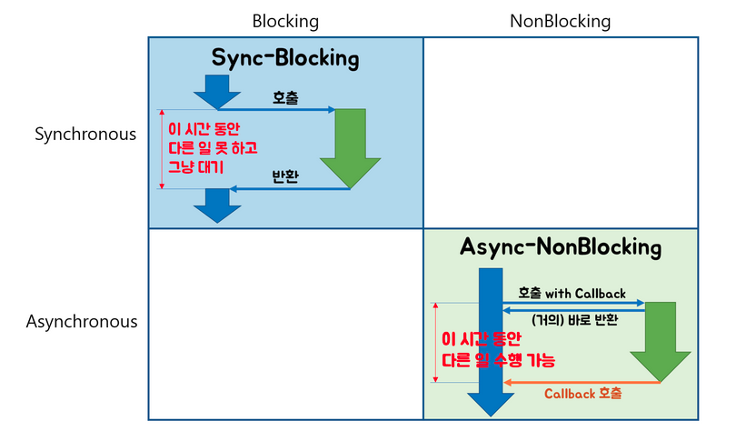

# 동기와 비동기 블록킹과 논블록킹

헷갈리는 개념이라 잘 정리된 여러개의 블로그를 보며 공부하고 그 내용을 정리하였습니다. (출처 하단에)

- 동기식 처리모델 : 직렬적으로 태스크 수행. 순차실행. 어떤 작업이 수행 중이면 다음 작업은 대기
- 비동기식 처리모델: 병렬적으로 태스크 수행. 태스크가 종료되지 않은 상태라도 대기하지 않고 다음 태스크 실행

**자주 접할 수 있는 오해**

흔히 동기는 블록킹, 비동기는 논블록킹으로 생각하기 쉬운데 이는 잘못된 것이다.
(보통의 웹앱에서 task는 Async-NonBlocking 방식으로 처리되는 경우가 많을 것이다.)

하지만, Async-Blocking의 경우도 존재하고, Sync-NonBlocking의 경우도 존재한다.
동기적으로 처리하면서 Non-Blocking이다? 상상이 잘 안간다.
비동기적으로 처리하면서 Blocking이다? 이건 상상 가능한 범주다. 매우 비효율적이라고 짐작 가능하다.

> Q. 동기식 처리모델은 Blocking으로 진행되는 것이고, 비동기식 처리모델은 NonBlocking으로 진행되는 것이다.

A. 웹앱에서 통상적으로 사용되는 방법이나 정확히 동치는 아니다.

이렇게 4가지의 경우가 존재

 
 

**정리1** 

> Synchronous / Asynchronous : 호출되는 함수의 작업 완료 여부를 누가 신경 쓰냐

→ 동기는 호출하는 함수가 호출되는 함수의 리턴을 기다리거나, 작업 결과를 신경쓴다.
호출하는 함수가 호출되는 함수의 작업 완료 후 리턴을 기다리거나, 또는 호출되는 함수로부터 바로 리턴 받더라도 작업 완료 여부를 호출하는 함수 스스로 계속 확인하며 신경쓰면 Synchronous다.

→ 비동기는 호출하는 함수가 호출되는 함수의 작업 완료 여부를 신경쓰지 않는다.
호출되는 함수에게 callback을 전달해서, 호출되는 함수의 작업이 완료되면 호출되는 함수가 전달받은 callback을 실행하고, 호출하는 함수는 작업 완료 여부를 신경쓰지 않으면 Asynchronous다.

> Blocking / NonBlocking : 호출되는 함수가 바로 리턴하느냐 마느냐

→ Blocking은 바로 리턴하지 않는다. 
호출하는 함수가 호출된 함수의 작업이 모두 마쳐질 때까지 대기해야 한다. 제어권이 없다.

→ NonBlocking은 바로 리턴한다. (제어문 수준에서 지체없이 반환한다)
호출하는 함수가 다른 일을 할 수 있도록 호출되는 함수가 바로 리턴해서 제어권을 넘겨준다.

 
 

**정리2**

> Synchronous / Asynchronous: 구분하는 기준은 작업 순서이다.

→ 동기식 모델은 모든 작업들이 일련의 순서를 따르며 그 순서에 맞게 동작한다.
즉, A,B,C 순서대로 작업이 시작되었다면 A,B,C 순서로 작업이 끝나야 한다. 설령 여러 작업이 동시에 처리되고 있다고 해도, 작업이 처리되는 모델의 순서가 보장된다면 이는 동기식 처리 모델이라고 할 수 있다.
 
→ 반면 비동기식 모델은 작업의 순서가 보장되지 않는다.
말그대로 비동기(Asynchronous) 처리 모델로, A,B,C 순서로 작업이 시작되어도 A,B,C 순서로 작업이 끝난다고 보장할 수 없다. 비동기식 처리 모델이 이득을 보는 경우는 각 작업이 분리될 수 있으며, Latency 가 큰 경우이다. 예를들어 각 클라이언트 또는 작업 별로 Latency 가 발생하는 네트워크 처리나 File I/O 등이 훌륭한 적용 예시이다.

> Blocking / NonBlocking: 구분하는 기준은 통지 이다.

→ Blocking 이란 말그대로 작업의 멈춤, 대기(Wait) 을 말한다. 
즉, 작업을 시작하고 작업이 끝날때까지 대기하다가 즉석에서 완료 통지를 받는다.

이 때 작업이 멈추는 동안 다른작업이 끼어들수 있는지 없는지는 다른 얘기이다. 이부분이 중요하면서도 헷갈린데, 많은 Blocking 방식의 사례에서 다른 작업의 Interrupt 를 방지하기 때문에, Blocking 은 곧 "순차처리" 로 생각하는 오류가 생긴다. 
(이렇게 생각해버리면 Blocking 과 Synchronous 모델은 같은 개념이 된다.) 
단순히 생각해서 Blocking 은 그저 작업을 수행하는 데 있어서 대기 시간을 갖는다는 의미일 뿐이다.

→ Non Blocking 이란 작업의 완료를 나중에 통지받는 개념이다.
작업의 시작 이후 완료시까지 대기하지 않고, 완료시킨다. 즉, 내부 동작에 무관하게 작업에 대한 완료를 처리받는 걸 말한다.

결국 다 같은 의미.

---
[출처]
1. 동기/비동기:  [Poiema web 5.31 Asynchronous processing model](https://poiemaweb.com/js-async) 공부
2. 동기/비동기:  [뒤태지존의 끄적거림](https://homoefficio.github.io/2017/02/19/Blocking-NonBlocking-Synchronous-Asynchronous/) 공부 (개념 설명이 비교적 명확하나 뒤지게 어려울 수 있음)
3. 동기/비동기: [어떤 블로그1](https://victorydntmd.tistory.com/8) 공부 (수행의 결과를 함수를 호출한 쪽에서 직접 처리하느냐, 아니면 다른 곳에서 처리하느냐)
4. 동기/비동기: [어떤블로그2](https://heecheolman.tistory.com/48) 공부 (비동기는 작업완료를 콜백이 신경씀)
5. 동기/비동기: [Jins' Dev Inside](https://jins-dev.tistory.com/entry/%EB%8F%99%EA%B8%B0Synchronous-%EC%9E%91%EC%97%85%EA%B3%BC-%EB%B9%84%EB%8F%99%EA%B8%B0Asynchronous-%EC%9E%91%EC%97%85-%EA%B7%B8%EB%A6%AC%EA%B3%A0-%EB%B8%94%EB%9D%BDBlocking-%EA%B3%BC-%EB%84%8C%EB%B8%94%EB%9D%BDNonBlocking-%EC%9D%98-%EA%B0%9C%EB%85%90) 공부 (동기 비동기는 작업순서, 블록킹 논블록킹은 통지)
6. 동기/비동기: [공부해서 남주자](https://private.tistory.com/24) 공부 (시험지 비유)
---